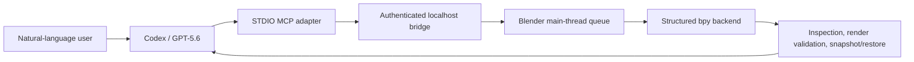

# Codex3D

**Create and refine Blender scenes in ordinary language, with structured tools, persistent identity, visual validation, and reversible edits.**

Codex3D is a local-first creative 3D agent for designers and first-time Blender users. Codex turns a user's intent into allowlisted MCP tools; a localhost bridge executes those actions on Blender's main thread, then returns scene inspection and render evidence for the next feedback turn.


> Unofficial Codex-inspired concept demo. Codex3D is not endorsed by OpenAI and does not reproduce an official logo.

## Why It Is Different

- **Structured, inspectable execution.** No arbitrary Python, `eval`, `exec`, shell MCP tool, or model-written `bpy` script.
- **Persistent identity and safe recovery.** Blender objects carry stable UUIDs; snapshots are session-bound, fingerprinted, and restored with an automatic safety snapshot.
- **Visual delivery gates.** Render validation checks framing, visibility, unwanted objects, luminance, overexposure, active camera, and animation metadata before delivery.

## 60-Second Quick Start

Supported reference setup: macOS arm64, Blender 5.1.1, Python 3.10+ (validated on 3.13.9), Codex CLI 0.135.0, and optional Homebrew FFmpeg 8.1.2.

```bash
python scripts/build_blender_extension.py
```

In Blender, use **Edit -> Preferences -> Extensions -> Install from Disk**, select the ZIP in `dist/`, enable Codex3D, open the 3D View sidebar, and click **Connect**. Export the displayed one-time token only in the terminal that launches the MCP adapter:

```bash
export CODEX3D_BRIDGE_HOST=127.0.0.1
export CODEX3D_BRIDGE_PORT=9876
export CODEX3D_BRIDGE_TOKEN='your-panel-token'
export PYTHONPATH=packages/protocol:apps/api:apps/mcp
python -m codex3d_mcp
```

See [Blender add-on installation](docs/blender_addon_install.md) and [Codex MCP setup](docs/codex_mcp.md) for verified commands and troubleshooting.

## Judge Path

Judges do not need to rebuild the connector source:

1. Install `codex3d-blender-extension-0.1.0.zip` from the release bundle.
2. Connect the Blender sidebar on `127.0.0.1`.
3. Configure the local STDIO MCP command from `docs/codex_mcp.md`.
4. Ask: `Inspect the scene, create a small glowing six-orbit emblem, render a preview, then make a snapshot before changing it.`
5. For a no-Blender smoke path, run:

```bash
PYTHONPATH=packages/protocol:apps/api:connectors/blender_addon \
python examples/hackathon_sprint_01_demo.py
```

Expected smoke result: 31 planned actions, 31 successes, and 16 inspected fake-backend objects.

## Three-Minute Demo

1. Start with an isolated blank Blender scene and describe the intended kinetic emblem.
2. Watch Codex call structured MCP tools while geometry appears progressively.
3. Give an aesthetic follow-up; inspect and rerender.
4. Reject a deliberately bad edit and restore the accepted snapshot.
5. Deliver the validated PNG, H.264 MP4, and versioned `.blend` checkpoint.

The recording script and fallback plan are in [DEMO_SCRIPT.md](DEMO_SCRIPT.md).

## Architecture



The MCP and API layers never import `bpy`. The socket thread never mutates Blender. All live scene access is pumped through `bpy.app.timers` on Blender's main thread.

## Codex and GPT-5.6

The primary build task is `019f7749-0bc7-7733-9d9a-17a37e273539`. Local Codex session records show `gpt-5.6-sol` applied repeatedly during the core implementation period beginning July 18, 2026. Codex accelerated protocol design, bridge/main-thread boundaries, MCP schemas, test generation, isolated Blender automation, failure diagnosis, and approval-safe restore/save design.

Human decisions remained explicit: Blender-first modular architecture; allowlisted Actions instead of arbitrary Python; localhost-only HMAC transport; stable UUIDs; artifact-root path confinement; reversible snapshots; and synthetic-test claims that do not overstate human usability.

The required `/feedback` result is still pending and is not the same as the task ID above. Run `/feedback` in that primary build task before submission.

## Evidence

- Default suite: **153 passed, 3 skipped**.
- Unchanged nine-turn synthetic novice test: **SYNTHETIC_PASS 100/100**.
- Real Blender: snapshot/restore, render, H.264 MP4, stable UUID, and GUI Timeline acceptance passed.
- Synthetic testing proves repeatable multi-turn execution, not human comprehension, trust, or satisfaction.

## Security Model

- Bridge binds only to `127.0.0.1` and authenticates with a one-time HMAC token.
- Tokens are excluded from logs, responses, release assets, and Git.
- Artifact writes are confined to an explicit root; traversal and overwrite are rejected.
- Restore is limited to registered session snapshots and creates a safety snapshot first.
- The extension exposes structured actions only, never arbitrary Python or shell execution.

See [SECURITY.md](SECURITY.md) for the threat boundary and reporting guidance.

## Tests

```bash
python -m pytest
python -m compileall apps packages connectors examples scripts tests
```

Real Blender and long-running synthetic tests are opt-in through their documented environment flags. The default test run does not launch Blender.

## Known Limits

- The full nine-turn synthetic creative flow takes about 17.5 minutes.
- Broad mutation batches may require approval; granular structured tools are the validated path.
- There is no Web UI.
- Stable UUID support exists, but full Scene IR reconciliation and long-term history do not.
- The tested platform is macOS arm64 with Blender 5.1.1; other platforms are not yet verified.

## License

MIT. See [LICENSE](LICENSE) and [THIRD_PARTY_NOTICES.md](THIRD_PARTY_NOTICES.md).
